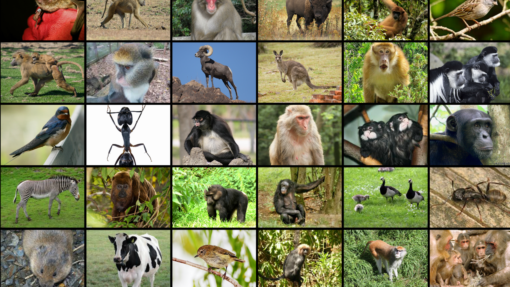

<!-- Section -->
<section>
	<header class="major">
		<h2>Databases</h2>
	</header>
	

		<article>
			
			<h3>MacaqueNet</h3>
			
A global collaborative community providing the largest publicly searchable database on animal social behavior, with data on 3,000+ macaques across 61 populations and 14 species, contributed by 118 researchers from 58 institutions in 18 countries.

			<ul class="actions">
				<li><a href="https://macaquenet.github.io/" class="button">Learn more</a></li>
			</ul>
		</article>
		<article>
			
			<h3>Animal Social Network Repository</h3>
			
A repository of interaction data from published studies of wild, captive, and domesticated animals across diverse taxa including mammals, birds, retiles, fish and insects.

			<ul class="actions">
				<li><a href="https://bansallab.github.io/asnr/" class="button">Learn more</a></li>
			</ul>
		</article>
		<article>
			
			<h3>New Database Coming Soon</h3>
		</article>
		<article>
			
			<h3>New Database Coming Soon</h3>
		</article>
		<article>
			
			<h3>New Database Coming Soon</h3>
		</article>
	

</section>

***

 

